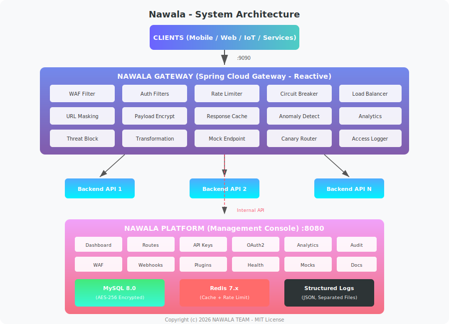
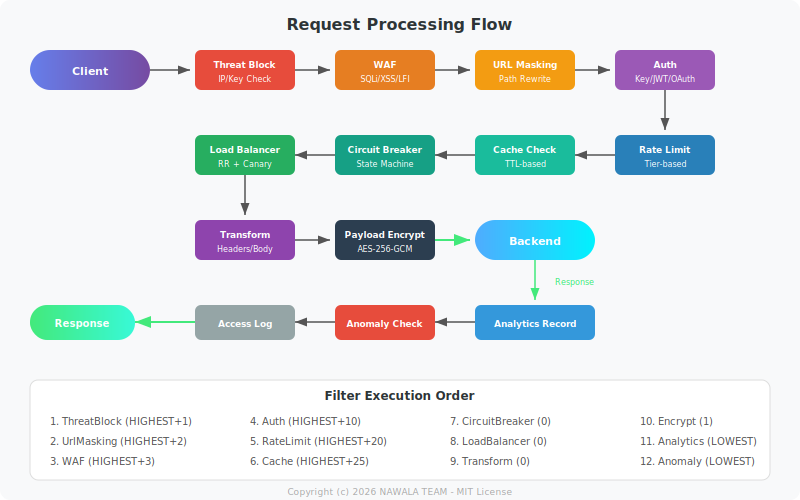

<p align="center">
  
</p>

<h1 align="center">🌐 Nawala — Enterprise API Gateway & Management Platform</h1>

<p align="center">
  <strong>Open-source API Gateway with built-in WAF, OAuth2, Rate Limiting, Anomaly Detection, and End-to-End Encryption.</strong><br/>
  Built with Java 17 + Spring Boot 3 + Spring Cloud Gateway.
</p>

<p align="center">
  <a href="#features">Features</a> •
  <a href="#architecture">Architecture</a> •
  <a href="#quick-start">Quick Start</a> •
  <a href="#configuration">Configuration</a> •
  <a href="#security">Security</a> •
  <a href="#contributing">Contributing</a> •
  <a href="#license">License</a>
</p>

<p align="center">
  
  
  
  
  
  
</p>

<p align="center">
  <a href="https://saweria.co/rdpf">
    
  </a>
</p>

---

## 💡 What is Nawala?

**Nawala** (from Sanskrit: "komunikasi / pesan") is a full-featured, production-ready **API Gateway** and **API Management Platform** designed for startups, enterprises, and developers who need secure, scalable, and intelligent API routing without vendor lock-in.

Unlike cloud-only solutions (AWS API Gateway, Apigee, Kong Enterprise), Nawala runs **entirely self-hosted** — giving you full control over your data, traffic, and security policies.

| Problem | Nawala Solution |
|---------|----------------|
| Cloud API Gateways are expensive at scale | Self-hosted, zero licensing cost |
| Complex multi-tool setups | All-in-one platform |
| No visibility into API anomalies | Built-in anomaly detection |
| Sensitive data exposed in transit | AES-256-GCM end-to-end payload encryption |
| Backend URLs exposed to clients | URL masking / path rewriting |
| No easy API lifecycle management | Full web console with MVVM architecture |

---


## ✨ Features

### 🔐 Security & Authentication
- **Multi-Auth Support** — API Key, JWT Bearer Token, OAuth2 Client Credentials
- **API Key Management** — Generate, rotate (24h grace period), revoke, scoped (IP/method/route)
- **OAuth2 Server** — Client registration, token issue/refresh/revoke/introspect (RFC 6749)
- **Web Application Firewall (WAF)** — SQL injection, XSS, path traversal + custom rules
- **AES-256-GCM Encryption** — Database field encryption + end-to-end payload encryption
- **Internal API Security** — Shared-secret header validation for service-to-service calls

### 🚦 Traffic Management
- **Tiered Rate Limiting** — FREE / STARTER / PROFESSIONAL / ENTERPRISE / UNLIMITED
- **Multi-Window Rate Limit** — Per-minute, per-hour, per-day sliding windows
- **Circuit Breaker** — CLOSED → OPEN → HALF_OPEN with configurable thresholds
- **Load Balancer** — Round-robin + canary routing with weighted distribution
- **Response Caching** — Configurable TTL per route
- **Request/Response Transformation** — Header injection, body transformation pipeline

### 🧠 Intelligence & Monitoring
- **Anomaly Detection** — Spike detection, brute force detection, unusual hour analysis
- **Auto-Block** — Threats automatically blocked at gateway level
- **Health Monitor** — Scheduled health checks with UP/DOWN/DEGRADED tracking
- **Real-time Analytics** — Traffic, response times, status distribution, geo, hourly patterns
- **Structured Logging** — JSON format, separated files (app/error/security/access/health)

### 🔌 Extensibility
- **Plugin System** — JavaScript hooks (PRE_REQUEST, POST_RESPONSE, ERROR_HANDLER, SCHEDULER)
- **Webhooks** — Event notifications with HMAC signing and exponential backoff retry
- **Mock/Sandbox** — Create mock endpoints for development and testing
- **API Documentation** — Built-in OpenAPI spec hosting with publish/unpublish workflow

### 🎯 Competitive Comparison

| Feature | Kong | AWS API GW | Apigee | **Nawala** |
|---------|:----:|:----------:|:------:|:----------:|
| Self-hosted + Free | ✅ | ❌ | ❌ | ✅ |
| Built-in WAF | ❌ | Separate | ❌ | ✅ |
| Anomaly Detection | ❌ | ❌ | ❌ | ✅ |
| Payload Encryption (E2E) | ❌ | ❌ | ❌ | ✅ |
| URL Masking | ❌ | ❌ | ❌ | ✅ |
| Plugin System (JS) | Lua | ❌ | ❌ | ✅ |
| Full Web Console | Paid | AWS Console | Paid | ✅ |
| Canary Routing | Paid | ❌ | Paid | ✅ |

---

## 🏗️ Architecture

<p align="center">
  
</p>

### Request Processing Flow

<p align="center">
  
</p>

### Tech Stack

| Layer | Technology |
|-------|-----------|
| Language | Java 17 (LTS) |
| Framework | Spring Boot 3.2.5 |
| Gateway | Spring Cloud Gateway (Reactive/WebFlux) |
| Frontend | Thymeleaf + Custom CSS + Vanilla JS |
| Database | MySQL 8.0 |
| Cache | Redis 7.x |
| Security | Spring Security 6 + BCrypt(12) + AES-256-GCM |
| Build | Maven (Multi-module) |
| Logging | Logback + SLF4J (JSON structured) |
| Pattern | MVVM (Model-View-ViewModel) |

---


## 🚀 Quick Start

### Prerequisites

| Software | Version | Required |
|----------|---------|----------|
| Java JDK | 17+ | ✅ |
| Maven | 3.8+ | ✅ |
| MySQL | 8.0+ | ✅ |
| Redis | 7.x | ✅ |
| Git | 2.x | ✅ |

### Installation

```bash
# 1. Clone the repository
git clone https://github.com/dansiapa/nawala-gateway-platform.git
cd nawala-gateway-platform

# 2. Create MySQL database
mysql -u root -e "CREATE DATABASE nawala_db CHARACTER SET utf8mb4 COLLATE utf8mb4_unicode_ci;"

# 3. Start Redis
redis-server

# 4. Build the project
./mvnw clean package -DskipTests

# 5. Start Platform (Management Console)
java -jar platform/target/nawala-platform-1.0.0.jar

# 6. Start Gateway (separate terminal)
java -jar gateway/target/nawala-gateway-1.0.0.jar
```

### Service Endpoints

| Service | Port | Description |
|---------|------|-------------|
| Platform Console | `:8080` | Web management UI |
| API Gateway | `:9090` | Gateway routing endpoint |
| Default Admin | `admin` / `admin123` | Change immediately after first login! |

---

## ⚙️ Configuration

### Platform

```properties
spring.datasource.url=jdbc:mysql://<DB_HOST>:3306/nawala_db?useSSL=false&serverTimezone=Asia/Jakarta
spring.datasource.username=<DB_USER>
spring.datasource.password=<DB_PASS>
nawala.encryption.key=<YOUR_BASE64_AES_256_KEY>
nawala.internal.secret=<YOUR_INTERNAL_SECRET>
```

### Gateway

```properties
nawala.gateway.platform-url=http://<PLATFORM_HOST>:8080
nawala.gateway.internal-secret=<YOUR_INTERNAL_SECRET>
nawala.gateway.jwt.secret=<YOUR_BASE64_JWT_SECRET>
nawala.gateway.payload-key=<YOUR_BASE64_AES_256_KEY>
spring.data.redis.host=<REDIS_HOST>
spring.data.redis.port=6379
```

### Generate Secure Keys

```bash
openssl rand -base64 32   # AES-256 key
openssl rand -base64 64   # JWT secret
openssl rand -hex 32      # Internal secret
```


## 📖 Complete Usage Guide

This guide walks you through the entire workflow from first login to full production-ready API management.

### Step 1: First Login

After installation, access the Platform Console:

```
URL      : http://<HOST>:8080/login
Username : admin
Password : admin123
```

> **Important:** Change the default password immediately via Profile → Change Password.

### Step 2: Register Your First API Route

This is the core action — registering a backend service so the gateway can route traffic to it.

**Navigate:** Dashboard → **API Routes** → **Add Route**

| Field | Example | Description |
|-------|---------|-------------|
| Route Name | `user-service` | Unique identifier for this route |
| Gateway Path | `/api/v1/users/**` | Public path exposed through the gateway |
| Target URL | `http://10.0.1.50:3000` | Your actual backend service address |
| HTTP Methods | `GET,POST,PUT,DELETE` | Allowed methods |
| Strip Prefix | `0` | Path segments to remove before forwarding |
| Auth Required | `true` | Require authentication |
| Rate Limit Tier | `PROFESSIONAL` | Rate limit tier |
| Enable Caching | `false` | Cache responses at gateway |
| Circuit Breaker | `true` | Enable circuit breaking |

Click **Save** — the route is immediately active on the gateway (port `:9090`).

**How it works:**
```
Client Request:   GET http://<GATEWAY>:9090/api/v1/users/42
Gateway Routes:   GET http://10.0.1.50:3000/api/v1/users/42
Response:         Flows back through gateway filters to client
```

### Step 3: Generate an API Key

Your route requires authentication. Generate an API key for consumers:

**Navigate:** Dashboard → **API Keys** → **Generate New Key**

| Field | Example | Description |
|-------|---------|-------------|
| Key Name | `mobile-app-prod` | Human-readable label |
| Tier | `PROFESSIONAL` | Rate limit tier |
| Expires At | `2027-01-01` (optional) | Auto-expiry date |
| IP Whitelist | `192.168.1.0/24` (optional) | Restrict to IPs |
| Allowed Methods | `GET,POST` (optional) | Restrict methods |
| Allowed Routes | `/api/v1/users/**` (optional) | Restrict routes |

Key displayed **once**: `nwl_a1b2c3d4e5f6...` — store securely, cannot be retrieved again.

### Step 4: Test Your Route

```bash
curl -H "X-API-Key: nwl_a1b2c3d4e5f6..." http://<GATEWAY>:9090/api/v1/users
# Response: {"users": [{"id": 1, "name": "John"}]}
```

**Error responses:**

| Status | Meaning | Solution |
|--------|---------|----------|
| `401` | Missing/invalid API key | Check X-API-Key header |
| `403` | Key not allowed for route/method | Check key scoping |
| `429` | Rate limit exceeded | Wait or upgrade tier |
| `502` | Backend not reachable | Check target URL |
| `503` | Circuit breaker OPEN | Backend is down |

### Step 5: URL Masking

Hide your real backend paths from clients:

**In Route config, set Mask Path:**

| Gateway Path (public) | Target URL (hidden) |
|----------------------|---------------------|
| `/api/v1/products/**` | `http://10.0.1.50:8081/internal/catalog/v2/**` |
| `/api/v1/orders/**` | `http://10.0.2.30:4000/legacy/order-system/**` |

The client only sees `/api/v1/products/123` — never knows the actual internal URL.

### Step 6: Configure OAuth2 (Alternative Auth)

For service-to-service communication, use OAuth2 Client Credentials:

**Navigate:** Dashboard → **OAuth** → **Register Client**

| Field | Example |
|-------|--------|
| Client Name | `payment-service` |
| Scopes | `read,write,admin` |
| Token TTL | `3600` (seconds) |

You receive `client_id` + `client_secret`.

**Complete Token Flow:**
```bash
# 1. Request access token
curl -X POST http://<GATEWAY>:9090/oauth/token \
  -H "Content-Type: application/x-www-form-urlencoded" \
  -d "grant_type=client_credentials" \
  -d "client_id=YOUR_CLIENT_ID" \
  -d "client_secret=YOUR_CLIENT_SECRET" \
  -d "scope=read write"

# Response:
# {"access_token":"eyJhbG...","token_type":"Bearer","expires_in":3600}

# 2. Use token to call API
curl -H "Authorization: Bearer eyJhbG..." \
     http://<GATEWAY>:9090/api/v1/users

# 3. Check if token is still valid
curl -X POST http://<GATEWAY>:9090/oauth/introspect \
  -d "token=eyJhbG..."

# 4. Revoke token when done
curl -X POST http://<GATEWAY>:9090/oauth/revoke \
  -d "token=eyJhbG..."
```

### Step 7: Configure WAF Rules

Protect your APIs from common attacks:

**Navigate:** Dashboard → **WAF** → **Add Rule**

| Rule Name | Pattern | Type | Action |
|-----------|---------|------|--------|
| `block-sqli` | `UNION SELECT`, `DROP TABLE` | `BODY` | `BLOCK` |
| `block-xss` | `<script>`, `javascript:` | `BODY` | `BLOCK` |
| `block-traversal` | `../`, `..\\` | `PATH` | `BLOCK` |
| `block-admin` | `/admin.*` | `PATH` | `BLOCK` |

When matched: `403 Forbidden` with WAF rule info.

View blocked attempts: **Security → Threats**

### Step 8: Set Up Webhooks

Get notified when events happen:

**Navigate:** Dashboard → **Webhooks** → **Add Webhook**

| Field | Example |
|-------|--------|
| URL | `https://your-app.com/hooks/nawala` |
| Secret | `whsec_mysecret123` |
| Events | `threat.detected, health.status_changed` |

**Available Events:**

| Event | Trigger |
|-------|---------|
| `route.created` | New route registered |
| `route.updated` | Route config changed |
| `route.deleted` | Route removed |
| `apikey.created` | New API key generated |
| `apikey.revoked` | API key revoked |
| `threat.detected` | WAF blocked a request |
| `health.status_changed` | Backend UP/DOWN change |
| `anomaly.detected` | Anomaly triggered |

**Payload example:**
```json
{
  "event": "threat.detected",
  "timestamp": "2026-07-17T10:30:45Z",
  "data": {
    "ip": "103.xx.xx.xx",
    "rule": "SQL_INJECTION",
    "path": "/api/v1/users?id=1 OR 1=1"
  },
  "signature": "sha256=a1b2c3..."
}
```

Retry: exponential backoff (1s, 2s, 4s, 8s, 16s) — max 5 attempts.

### Step 9: Anomaly Detection

Nawala automatically detects unusual patterns:

| Anomaly Type | Detection Logic | Auto-Action |
|-------------|----------------|-------------|
| **Traffic Spike** | Requests > 5x baseline in 1 min | Alert + auto-block |
| **Brute Force** | 10+ failed auth/min from same IP | Auto-block IP 1 hour |
| **Unusual Hour** | Traffic outside business hours | Flag + alert |
| **Error Spike** | Error rate > 50% in 5 min | Trigger circuit breaker |

View detected anomalies: **Analytics → Anomaly tab**

### Step 10: Rate Limiting

Each API key is assigned a tier that controls request limits:

| Tier | Per Minute | Per Hour | Per Day |
|------|-----------|----------|--------|
| FREE | 10 | 100 | 1,000 |
| STARTER | 60 | 1,000 | 10,000 |
| PROFESSIONAL | 300 | 10,000 | 100,000 |
| ENTERPRISE | 1,000 | 50,000 | 500,000 |
| UNLIMITED | No limit | No limit | No limit |

**Response headers on every request:**
```
X-RateLimit-Limit: 300
X-RateLimit-Remaining: 245
X-RateLimit-Reset: 1720000000
```

**When exceeded:**
```json
{"status": 429, "error": "Too Many Requests", "message": "Rate limit exceeded. Retry after 45 seconds."}
```

### Step 11: Circuit Breaker

Protects backend from cascading failures. Configured per route:

| Parameter | Default | Description |
|-----------|---------|-------------|
| Failure Threshold | 5 | Consecutive failures to open circuit |
| Success Threshold | 3 | Successes in half-open to close |
| Timeout | 60s | Time in OPEN before HALF_OPEN |

**State transitions:**
```
CLOSED (normal) → 5 failures → OPEN (instant 503)
OPEN → 60s timeout → HALF_OPEN (test requests)
HALF_OPEN → 3 successes → CLOSED (recovered)
HALF_OPEN → 1 failure → OPEN (still down)
```

### Step 12: End-to-End Payload Encryption

Encrypt request/response body between client and gateway:

```bash
# Client encrypts payload before sending
PAYLOAD='\''{"username":"admin","password":"secret"}'\'' 
ENCRYPTED=$(echo "$PAYLOAD" | openssl enc -aes-256-gcm -base64 -K $KEY -iv $IV)

# Send encrypted request
curl -X POST http://<GATEWAY>:9090/api/v1/login \
  -H "X-Encrypted: true" \
  -H "X-Encryption-IV: $(echo -n $IV | base64)" \
  -d "$ENCRYPTED"
```

**Gateway process:**
1. Receives encrypted body
2. Decrypts with shared AES-256 key
3. Forwards plaintext to backend
4. Receives backend response
5. Encrypts response body
6. Returns encrypted response to client

### Step 13: Create Mock Endpoints

Build API mocks for development and testing without a real backend:

**Navigate:** Dashboard → **Mocks** → **Create Mock**

| Field | Example |
|-------|--------|
| Path | `/api/v1/mock/users` |
| Method | `GET` |
| Status Code | `200` |
| Response Body | `{"users":[{"id":1,"name":"Test"}]}` |
| Delay (ms) | `200` |
| Content-Type | `application/json` |

```bash
# Access mock (no auth required)
curl http://<GATEWAY>:9090/api/v1/mock/users
# Returns: {"users":[{"id":1,"name":"Test"}]}
```

### Step 14: Plugin System

Extend gateway behavior with JavaScript hooks:

**Navigate:** Dashboard → **Plugins** → **Create Plugin**

| Hook Type | Executes When |
|-----------|---------------|
| `PRE_REQUEST` | Before forwarding to backend |
| `POST_RESPONSE` | After receiving backend response |
| `ERROR_HANDLER` | When an error occurs |
| `SCHEDULER` | On a cron schedule |

**Example — Add custom header based on path:**
```javascript
function execute(request, context) {
    if (request.path.startsWith('/api/v1/premium')) {
        request.headers['X-Premium-Access'] = 'true';
        request.headers['X-Request-ID'] = context.generateId();
    }
    return request;
}
```

### Step 15: Health Monitoring

Nawala checks all registered backends every 60 seconds:

| Status | Condition |
|--------|-----------|
| `UP` | Responds within 5s with HTTP 2xx |
| `DOWN` | No response or HTTP 5xx |
| `DEGRADED` | Responds > 3s or intermittent errors |

**View:** Security → **Health Monitor**

When status changes → triggers `health.status_changed` webhook.

### Step 16: API Documentation Hosting

Host OpenAPI/Swagger specs directly in Nawala:

1. Navigate: Dashboard → **API Docs** → **Upload Spec**
2. Upload `.json` or `.yaml` file (OpenAPI 3.0)
3. Click **Publish**
4. Public URL: `http://<HOST>:8080/public/docs/{doc-id}`

Share this URL with API consumers for interactive documentation.

### Step 17: Analytics Dashboard

Real-time metrics for all your APIs:

| Metric | Description |
|--------|-------------|
| Total Requests | Hourly / Daily / Monthly counts |
| Response Time | p50, p95, p99 percentiles |
| Status Distribution | 2xx / 4xx / 5xx breakdown |
| Top Routes | Most-accessed endpoints |
| Top Consumers | Most-active API keys |
| Geographic | Request origins by country |
| Hourly Patterns | Traffic patterns by hour |
| Error Trends | Error rate over time |

### Step 18: Admin Panel (ADMIN Role)

| Section | Purpose |
|---------|---------|
| **Users** | Create/edit/delete users, assign roles (USER/ADMIN) |
| **Audit Log** | Complete history of all system actions |
| **Tier Management** | Create custom rate limit tiers |
| **System Dashboard** | Server CPU/memory, DB connections, Redis stats |

### Step 19: Key Rotation (Production Best Practice)

Rotate API keys without downtime:

1. **API Keys** → Select key → **Rotate**
2. New key generated immediately
3. Old key remains valid for 24-hour grace period
4. Update your application with new key
5. After 24h, old key auto-expires

### Step 20: Monitoring Logs

Check separated log files for troubleshooting:

```bash
# Application logs (general)
tail -f logs/platform/application.log

# Error logs only
tail -f logs/platform/error.log

# Security events (auth failures, threats)
tail -f logs/platform/security.log

# HTTP access log
tail -f logs/platform/access.log

# Gateway-specific logs
tail -f logs/gateway/application.log
tail -f logs/gateway/security.log
```

All logs are JSON-formatted with ISO 8601 timestamps for easy parsing with ELK, Grafana Loki, or any log aggregator.

---

## 🔒 Security

### Encryption Layers

| Layer | Algorithm | Purpose |
|-------|-----------|---------|
| Database Fields | AES-256-GCM | Encrypt PII (email, phone, URLs) |
| Passwords | BCrypt (cost=12) | Password hashing |
| API Keys | BCrypt + SecureRandom | Key storage |
| Payload (E2E) | AES-256-GCM | Request/response body encryption |
| Sessions | JSESSIONID + HttpOnly | Session management |

### WAF Rules (Default)

| Rule | Pattern | Action |
|------|---------|--------|
| SQL Injection | `UNION SELECT`, `DROP TABLE`, `\' OR \'` | BLOCK (403) |
| XSS | `<script>`, `javascript:`, `onerror=` | BLOCK (403) |
| Path Traversal | `../`, `..\\`, `%2e%2e` | BLOCK (403) |

### API Authentication Methods

```bash
# API Key
curl -H "X-API-Key: nwl_YOUR_KEY_HERE" http://<GATEWAY>:9090/api/v1/users

# JWT Bearer
curl -H "Authorization: Bearer YOUR_JWT_TOKEN" http://<GATEWAY>:9090/api/v1/users

# OAuth2 Client Credentials
curl -X POST http://<GATEWAY>:9090/oauth/token \
  -d "grant_type=client_credentials&client_id=ID&client_secret=SECRET"
```

---

## 📊 Logging

Structured ISO 8601 JSON logging with separated files:

```
logs/
├── platform/
│   ├── application.log    # General (JSON)
│   ├── error.log          # ERROR only
│   ├── security.log       # Auth & threats
│   ├── access.log         # HTTP access
│   ├── health.log         # Health checks
│   └── archive/           # Rotated (.gz)
└── gateway/
    ├── application.log
    ├── error.log
    ├── security.log
    ├── access.log
    └── archive/
```

---

## 📁 Project Structure

```
nawala-gateway-platform/
├── pom.xml                    # Parent POM (multi-module)
├── platform/                  # Management Console
│   └── src/main/java/id/nawala/platform/
│       ├── config/            # Security, Encryption, Scheduling
│       ├── controller/        # 14 MVC controllers
│       ├── model/             # 19 JPA entities
│       ├── repository/        # 18 Spring Data repositories
│       ├── service/impl/      # 15 service implementations
│       ├── util/              # Encryption utilities
│       └── viewmodel/         # MVVM view models
├── gateway/                   # API Gateway (Reactive)
│   └── src/main/java/id/nawala/gateway/
│       ├── circuitbreaker/    # Circuit breaker registry
│       ├── config/            # Routing & security
│       ├── filter/            # 17 gateway filters
│       └── logging/           # Gateway logging
└── logs/                      # Separated log output
```

---

## 🛣️ Roadmap

- [ ] GraphQL Gateway support
- [ ] gRPC proxy
- [ ] Kubernetes Ingress Controller mode
- [ ] Admin REST API + CLI tool
- [ ] Prometheus + Grafana metrics export
- [ ] Multi-tenancy support
- [ ] Docker Compose one-click deployment

---

## 🤝 Contributing

See [CONTRIBUTING.md](CONTRIBUTING.md) for detailed guidelines.

---

## ☕ Support This Project

<p align="center">
  <a href="https://saweria.co/rdpf">
    
  </a>
</p>

<p align="center">
  <a href="https://saweria.co/rdpf"><strong>👉 https://saweria.co/rdpf 👈</strong></a>
</p>

---

## 📜 License

Copyright © 2026 **NAWALA TEAM**. All rights reserved.

Licensed under the [MIT License](LICENSE). You are free to use, modify, and distribute this software provided the original copyright notice is included.

---

## 🏷️ Keywords

`api-gateway` `api-management` `spring-boot` `spring-cloud-gateway` `java` `microservices` `oauth2` `jwt` `rate-limiting` `waf` `web-application-firewall` `anomaly-detection` `api-security` `encryption` `circuit-breaker` `load-balancer` `api-key-management` `webhooks` `api-analytics` `self-hosted` `open-source` `enterprise` `reverse-proxy` `developer-tools` `devops` `api-monitoring`

---

<p align="center">Made with ❤️ by <strong>NAWALA TEAM</strong> in Indonesia 🇮🇩</p>
<p align="center"><sub>Nawala — Secure Your APIs, Empower Your Platform.</sub></p>
<p align="center"><sub>Copyright © 2026 NAWALA TEAM. Licensed under MIT.</sub></p>
